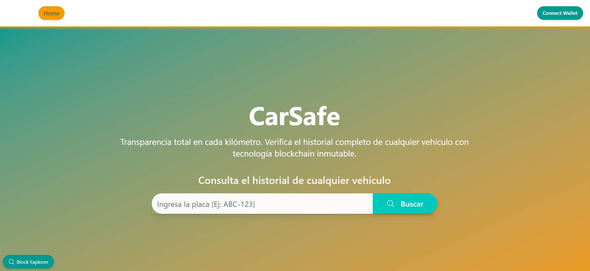
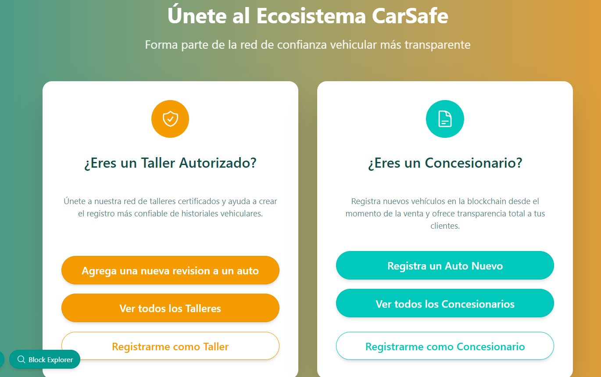

# 🚗 CarSafe - Sistema de Seguimiento de Vehiculos

[](https://nextjs.org/)
[](https://www.typescriptlang.org/)
[](https://tailwindcss.com/)
[](https://soliditylang.org/)
[](https://opensource.org/licenses/MIT)





CarSafe es una aplicación web moderna que conecta usuarios con talleres mecánicos confiables, ofreciendo un sistema de calificaciones, gestión de citas y transparencia en los servicios automotrices.

## ✨ Características Principales

### 🔧 Para Concecionarios
- **Registro de Vehiculo**: Encuentra talleres mecánicos por ubicación, servicio y calificación
- **Reporte de concecionarios**: Lista de los concecionarios autorizados
- **Registro concecionario**: registro de concecionario


### 🔧 Para Usuarios
- **Búsqueda**: Busqueda por la placa del automovil
- **Verificar talleres**: Lista talleres autorizados

### 🏢 Para Talleres
- **Registro de nuevos talleres**: Registra un nuevo automovil


### ⚡ Tecnológico
- **Blockchain Integration**: Verificación transparente mediante smart contracts
- **Tiempo Real**: Notificaciones y actualizaciones en tiempo real
- **Responsive Design**: Experiencia optimizada para todos los dispositivos

## 🚀 Demo en Vivo

🌐 **URL de Producción**: [https://carsafe.vercel.app](https://carsafe.vercel.app)

📱 **Demo Mobile**: Compatible con todos los dispositivos

## 🛠️ Tecnologías Utilizadas

### Frontend
- **Next.js 14**: Framework React con App Router
- **TypeScript**: Tipado estático para mayor robustez
- **Tailwind CSS**: Framework CSS utility-first
- **DaisyUI**: Component library para Tailwind CSS
- **React Hook Form**: Manejo de formularios eficiente


### Backend & Blockchain
- **Solidity 0.8.19**: Smart contracts en Ethereum
- **Foundry**: Entorno de desarrollo para Ethereum
- **OpenZeppelin**: Contratos seguros y auditados
- **Scaffold Eth** : Marco inicial proyecto

### Infraestructura
- **Vercel**: Despliegue y hosting frontend
- **Sepolia** : Despliegue de contrato


## 📦 Instalación y Configuración

### Prerrequisitos
- Node.js 18+ 
- npm o yarn
- Git

### 1. Clonar el Repositorio
```bash
git clone https://github.com/mollicris/carsafe.git
cd carsafe